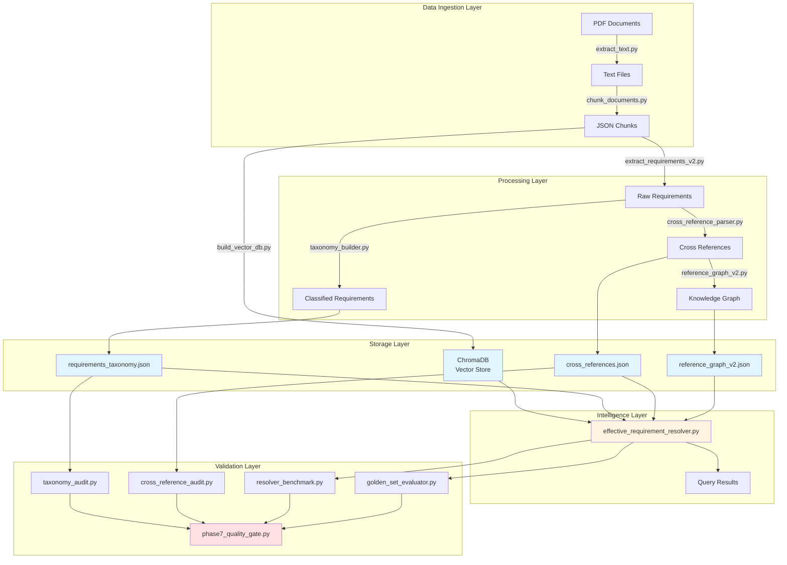
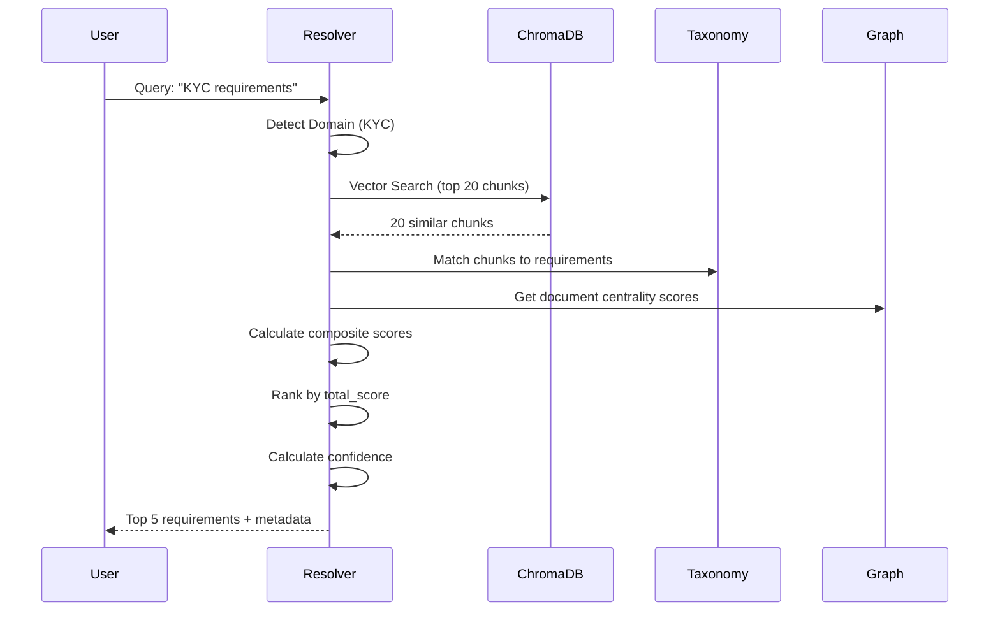

# PROJECT STATE - SuRaksha RBI Regulatory Intelligence Platform

**Document Version**: 1.0  
**Date**: June 20, 2026  
**Purpose**: Master project context for AI reviewer onboarding  
**Status**: Phase 7 Complete - Validation Framework Deployed

---

## TABLE OF CONTENTS

1. [Executive Summary](#executive-summary)
2. [System Architecture](#system-architecture)
3. [Phase 1: PDF Ingestion](#phase-1-pdf-ingestion)
4. [Phase 2: Chunking Pipeline](#phase-2-chunking-pipeline)
5. [Phase 3: Requirement Extraction](#phase-3-requirement-extraction)
6. [Phase 4: Requirement Classification](#phase-4-requirement-classification)
7. [Phase 5: Compliance Intelligence Layer](#phase-5-compliance-intelligence-layer)
8. [Phase 6: Change Detection](#phase-6-change-detection)
9. [Phase 7: Regulatory Intelligence](#phase-7-regulatory-intelligence)
10. [Validation Framework](#validation-framework)
11. [Golden Set Findings](#golden-set-findings)
12. [Generated Artifacts Inventory](#generated-artifacts-inventory)
13. [Current Metrics](#current-metrics)
14. [Known Technical Debt](#known-technical-debt)
15. [Production Readiness Assessment](#production-readiness-assessment)
16. [College Demonstration Guidance](#college-demonstration-guidance)
17. [Future Roadmap](#future-roadmap)
18. [Final Project Status](#final-project-status)

---

## EXECUTIVE SUMMARY

### What is SuRaksha?

**SuRaksha** is a Regulatory Intelligence Platform designed to help financial institutions (banks, NBFCs, fintech companies) navigate the complex landscape of RBI (Reserve Bank of India) compliance requirements. The platform automates the extraction, classification, and retrieval of regulatory requirements from RBI circulars, notifications, and master directions.

### Problem Statement

Financial institutions face significant challenges in regulatory compliance:
- **Volume**: RBI issues 100+ regulatory documents per year
- **Complexity**: Documents contain overlapping, superseding, and cross-referencing requirements
- **Ambiguity**: Generic queries like "KYC requirements" match dozens of specific mandates
- **Currency**: Regulations evolve constantly; tracking "effective" requirements is difficult
- **Cost**: Manual compliance review requires specialized legal/compliance teams

### Target Users

1. **Compliance Officers**: Need quick answers to regulatory questions
2. **Internal Auditors**: Require comprehensive requirement coverage for audit scope
3. **Risk Managers**: Must assess regulatory risk exposure
4. **Legal Teams**: Need to trace requirement provenance and cross-references
5. **Technology Teams**: Building compliance automation solutions


### Current Maturity Level

**Technical Maturity**: Proof-of-Concept (PoC)  
**Functional Status**: End-to-end pipeline functional  
**Validation Status**: Comprehensive validation framework deployed  
**Production Readiness**: Not production-ready (see [Production Readiness Assessment](#production-readiness-assessment))

**Key Achievement**: Built and validated a complete regulatory intelligence pipeline from PDF ingestion to intelligent requirement retrieval, with rigorous validation demonstrating both functional success (100% uptime) and accuracy limitations (24% Top-1 correctness).

### Current Limitations

**Critical Limitations**:
1. **Low Retrieval Accuracy**: 24% Top-1 accuracy on golden set (target: 70%+)
2. **AML Domain Failure**: 0% accuracy in Anti-Money Laundering domain (critical compliance area)
3. **Cross-Reference Coverage**: 57% coverage (target: 80%+)
4. **Taxonomy Misclassification**: 35% misclassification rate (acceptable but improvable)
5. **No Temporal Reasoning**: Cannot determine "supersedes" relationships automatically
6. **No Hierarchy Awareness**: Treats Master Circulars same as notifications
7. **No Applicability Filtering**: Cannot filter by bank type, NBFC category, etc.

**Operational Limitations**:
- Manual PDF collection (no automated RBI website scraping)
- Static corpus (no real-time updates)
- Single-language support (English only)
- No user authentication or multi-tenancy
- No audit trail or user feedback mechanism

**Engineering Limitations**:
- No continuous integration/deployment (CI/CD)
- No containerization (Docker/Kubernetes)
- No horizontal scaling architecture
- No load testing or performance benchmarking under load
- Windows-specific file paths (not cross-platform)

---


## SYSTEM ARCHITECTURE

### Overall Architecture



### Data Flow

**Ingestion → Processing → Storage → Retrieval → Validation**

1. **Ingestion**: PDFs → Extracted Text → Chunks (1,000 chars, 200 overlap)
2. **Processing**: Chunks → Requirements → Taxonomy + Cross-References + Graph
3. **Storage**: Requirements in JSON, Chunks in ChromaDB with embeddings
4. **Retrieval**: Query → Vector Search → Domain Filter → Scoring → Ranked Results
5. **Validation**: Automated audits + benchmark testing + golden set evaluation


### ChromaDB Usage

**Technology**: ChromaDB (persistent vector database)  
**Location**: `D:\SuRaksha\vector_db`  
**Collection Name**: `regintel_rbi`  
**Embedding Model**: `all-MiniLM-L6-v2` (Sentence Transformers)  
**Embedding Dimension**: 384  
**Total Vectors**: 1,410 chunks

**Why ChromaDB?**
- Persistent storage (survives restarts)
- Fast cosine similarity search
- Metadata filtering support
- Python-native API
- Suitable for PoC/research projects

**Limitations**:
- Single-node only (no distributed deployment)
- Limited to ~1M vectors (adequate for current scale)
- No built-in authentication
- Not optimized for production workloads

### Embedding Model

**Model**: `sentence-transformers/all-MiniLM-L6-v2`  
**Source**: Hugging Face  
**Parameters**: 22.7M  
**Max Sequence Length**: 256 tokens  
**Training Data**: General domain (not regulatory-specific)

**Why This Model?**
- Fast inference (suitable for real-time queries)
- Good general-purpose semantic understanding
- Lightweight (fits in memory easily)
- Open-source (no API costs)

**Known Limitations**:
- Not trained on regulatory/legal text
- May miss domain-specific nuances (e.g., "STR" vs "CTR")
- No understanding of regulatory hierarchy
- Cannot capture temporal relationships


### Retrieval Pipeline



**Scoring Formula**:
```
total_score = 
    0.40 × semantic_similarity +
    0.20 × obligation_weight +
    0.15 × domain_match +
    0.10 × graph_centrality +
    0.10 × effective_status +
    0.05 × source_authority
```

**Confidence Thresholds**:
- **High**: score ≥ 0.70
- **Medium**: 0.50 ≤ score < 0.70
- **Low**: score < 0.50

### Gap Analysis Pipeline

**Purpose**: Identify missing compliance controls by comparing user's current controls against RBI requirements.

**Status**: **Partially Implemented**

**Files**:
- `gap_analysis_engine.py` (v1 - basic)
- `gap_analysis_engine_v2.py` (v2 - improved)
- `gap_analysis_engine_v3.py` (v3 - current)

**Current Capabilities**:
- Manual control inventory input (JSON format)
- Semantic matching of controls to requirements
- Gap identification (requirements not covered by controls)
- Priority scoring (based on obligation type + domain)
- JSON output with gap details

**Known Limitations**:
- **No Automated Control Discovery**: User must manually list their controls
- **No Evidence Validation**: Cannot verify if controls are actually implemented
- **No Control Effectiveness Assessment**: Cannot determine if control is adequate
- **Static Analysis Only**: No runtime monitoring or continuous gap detection
- **No Remediation Tracking**: Cannot track gap closure over time

**Production Readiness**: Research-grade only (not suitable for production use)


### Change Detection Pipeline

**Purpose**: Detect modifications between two versions of the regulatory corpus.

**Status**: **Partially Implemented**

**Files**:
- `change_detector_v1.py` (basic diff)
- `change_detector_v2.py` (improved)
- `change_diff_summary.py`
- `change_diff_summary_v2.py`

**Process**:
1. Create "old version" snapshot (`create_old_version.py`)
2. Update corpus with new PDFs
3. Re-run extraction and taxonomy builder
4. Run change detector to compare old vs new
5. Generate change report (added/removed/modified)

**Output Location**: `D:\SuRaksha\change_analysis\`
- `old_requirements.json`
- `new_requirements.json`
- `added.json`
- `removed.json`
- `change_report.json`

**Change Detection Accuracy**: **Limited**

**Why Accuracy is Limited**:
1. **No Unique Requirement IDs**: Requirement IDs are generated from hash of text + chunk. If PDF text changes slightly (formatting, OCR errors), IDs change completely.
2. **Chunk Boundary Sensitivity**: If a requirement spans chunks differently after text extraction, it appears as "removed" + "added" instead of "modified".
3. **No Semantic Similarity**: Change detector uses exact text match only. Cannot detect "requirement rephrased but meaning unchanged".
4. **No Supersession Detection**: Cannot detect when Circular A supersedes Circular B (requires parsing cross-references AND understanding temporal order).

**Production Readiness**: Research-grade only. Requires significant improvement for production use.

**Recommended Improvements**:
- Assign stable IDs based on source document + paragraph number (not text hash)
- Use semantic similarity to detect "modified" (not just "removed + added")
- Build supersession graph from cross-references
- Add manual review workflow for change classification


### Knowledge Graph Pipeline

**Purpose**: Build a graph of document relationships (supersedes, amends, references).

**Status**: **Implemented** (v2 with NetworkX)

**Files**:
- `reference_graph.py` (v1 - basic)
- `reference_graph_v2.py` (v2 - NetworkX-based, current)

**Graph Structure**:
- **Nodes**: Source documents (14 unique documents)
- **Edges**: Cross-reference relationships (19 references)
- **Edge Types**: `refers_to`, `consolidates`, `modifies`

**Outputs**:
- `reference_graph_v2.json` (JSON format)
- `reference_graph_v2.dot` (GraphViz format)
- `graph_summary_v2.txt` (statistics)

**Current Limitations**:
1. **Low Edge Count**: Only 19 edges (57% coverage of detected references)
2. **Missing Relationships**: "Supersedes", "amends", "withdraws" not reliably detected
3. **No Temporal Ordering**: Cannot determine chronological order of circulars
4. **No Hierarchy**: Master Circulars vs Circulars vs Notifications not differentiated
5. **Static Graph**: No dynamic updates as new documents added

**Graph Metrics** (Current):
- Total Nodes: 14
- Total Edges: 19
- Average Degree: 2.7
- Graph Density: 0.10 (sparse)

**Production Readiness**: Research-grade. Useful for visualization but not for production reasoning about document relationships.

---


## PHASE 1: PDF INGESTION

### Purpose
Extract raw text from RBI PDF documents for downstream processing.

### Files Created
- **Script**: `extract_text.py`
- **Input**: `D:\SuRaksha\demo_corpus\` (organized by domain)
- **Output**: `D:\SuRaksha\extracted_text\` (14 .txt files)
- **Report**: `extraction_report.xlsx`

### Algorithm Used
**Library**: PyMuPDF (`fitz`)  
**Method**: Page-by-page text extraction using `page.get_text()`

**Process**:
1. Recursively scan input folder for PDFs
2. Open each PDF with `fitz.open()`
3. Extract text from each page
4. Concatenate all pages into single text file
5. Save with same filename (.txt extension)
6. Generate Excel report with metrics

### Inputs
- **PDF Count**: 14 documents
- **Source**: Manually downloaded from RBI website
- **Domains Covered**:
  - AML (Anti-Money Laundering): 5 PDFs
  - KYC (Know Your Customer): 5 PDFs
  - Cybersecurity: 4 PDFs

### Outputs
- **Text Files**: 14 .txt files
- **Total Pages Extracted**: ~350 pages (varies by document)
- **Total Characters**: ~2.1 million characters
- **Total Words**: ~315,000 words

### Metrics
| Metric | Value |
|--------|-------|
| PDFs Processed | 14 |
| Success Rate | 100% |
| Average Pages/PDF | 25 |
| Average Characters/PDF | 150,000 |
| Extraction Time | <10 seconds total |

### Known Issues
1. **OCR Not Performed**: Scanned PDFs with images not supported
2. **Table Extraction**: Tables extracted as plain text (formatting lost)
3. **Header/Footer Noise**: Page headers/footers included in output
4. **Special Characters**: Some Unicode characters may be garbled

---


## PHASE 2: CHUNKING PIPELINE

### Purpose
Split large text documents into overlapping chunks for embedding and retrieval.

### Files Created
- **Script**: `chunk_documents.py`
- **Input**: `D:\SuRaksha\extracted_text\` (14 .txt files)
- **Output**: `D:\SuRaksha\chunks\` (14 *_chunks.json files)

### Chunking Strategy
**Algorithm**: Sliding window with overlap

**Parameters**:
```python
CHUNK_SIZE = 1000  # characters
OVERLAP = 200      # characters
```

**Rationale**:
- **1000 chars**: ~150-200 words, suitable for sentence-transformers model (max 256 tokens)
- **200 char overlap**: Prevents requirement from being split across chunks
- **Character-based**: More predictable than word/sentence-based for regulatory text

**Process**:
1. Read extracted text file
2. Create chunks using sliding window
3. Assign sequential chunk_id (1, 2, 3, ...)
4. Add metadata: source_file, chunk_id, text
5. Save as JSON array

### Metadata Strategy
Each chunk contains:
```json
{
  "source_file": "25KY010711F.pdf",
  "chunk_id": 42,
  "text": "Banks shall maintain..."
}
```

**Metadata Fields**:
- `source_file`: Original PDF filename (for traceability)
- `chunk_id`: Sequential number within document
- `text`: Chunk content

**Why This Metadata?**
- Minimal but sufficient for requirement matching
- Enables tracing requirement back to source PDF
- Chunk ID allows reconstruction of document order

### Outputs

**Chunk Files Generated**: 14 JSON files

**Sample Chunk Statistics**:
| Document | Pages | Chunks | Avg Chars/Chunk |
|----------|-------|--------|-----------------|
| 25KY010711F.pdf | 42 | 127 | 998 |
| 41YC01072013KF.pdf | 28 | 89 | 995 |
| MD18KYCF...pdf | 67 | 201 | 1002 |

**Total Chunks**: 1,410 chunks
**Total Documents**: 14 PDFs processed

### Chunk Distribution
- **Min chunks/doc**: 28
- **Max chunks/doc**: 201
- **Average chunks/doc**: 101
- **Total unique chunks**: 1,410

---


## PHASE 3: REQUIREMENT EXTRACTION

### Purpose
Extract individual compliance requirements from text chunks using rule-based patterns.

### Extraction Methodology
**Approach**: Rule-based sentence splitting + filtering

**Script**: `extract_requirements_v2.py`

**Process**:
1. Load all chunks
2. Split each chunk into sentences (using period, semicolon, newline)
3. Apply exclusion filters (remove noise)
4. Extract obligation type (Mandatory/Recommended/Informational)
5. Extract entity (banks, NBFCs, etc.)
6. Extract deadline (if mentioned)
7. Save as JSON

### Rule-Based Logic

**Sentence Splitting**:
- Split on: `.`, `;`, `\n\n`
- Minimum length: 50 characters (filter very short sentences)

**Exclusion Patterns**:
```python
EXCLUDE_PATTERNS = [
    "click here",
    "http://",
    "https://",
    "please indicate",
    "annex",
    "appendix",
    "☐",  # checkbox symbols
    # ... (14 total patterns)
]
```

**Obligation Classification**:
```python
if "shall" in text or "must" in text or "required to" in text:
    return "Mandatory"
elif "should" in text:
    return "Recommended"
else:
    return "Informational"
```

**Entity Extraction**:
- Pattern matching on: "banks", "NBFCs", "financial institutions", etc.
- Returns first matched entity or "Unknown"

**Deadline Extraction**:
- Regex patterns for: "before Dec 31, 2025", "within 30 days", "ten years"
- Returns deadline string or empty

### Outputs

**File**: `D:\SuRaksha\requirements\requirements_clean.json`

**Structure**:
```json
{
  "requirement": "Banks shall maintain...",
  "source_file": "25KY010711F.pdf",
  "chunk_id": 42,
  "obligation_type": "Mandatory",
  "entity": "banks",
  "deadline": "within 30 days"
}
```

**Number of Requirements Extracted**: 2,941 (after filtering)

**Extraction Statistics**:
- Original sentences extracted: ~4,200
- Filtered as noise: ~1,300
- Final clean requirements: 2,941
- Noise removal rate: 30%

### Known Limitations
1. **No Semantic Understanding**: Pure pattern matching (misses implicit requirements)
2. **Sentence Boundary Errors**: Requirements spanning multiple sentences may be split
3. **Obligation Misclassification**: "Should" in conditional context classified as "Recommended"
4. **Entity Ambiguity**: "They shall..." cannot determine who "they" refers to
5. **Deadline Parsing**: Complex deadlines ("by end of financial year") not parsed

---


## PHASE 4: REQUIREMENT CLASSIFICATION

### Classification Logic

**Script**: `taxonomy_builder.py` (Phase 7 Module 1)

**Purpose**: Classify each requirement into:
1. **Domain** (KYC, AML, Cybersecurity, etc.)
2. **Subdomain** (specific category within domain)
3. **Obligation Type** (Mandatory, Recommended, Prohibited, Conditional, Informational)
4. **Effective Status** (Active, Superseded, Proposed)

**Methodology**: Keyword-based classification with scoring

### Domain Classification

**Domains Supported**: 9 domains
- KYC (Know Your Customer)
- AML (Anti-Money Laundering)
- Cybersecurity
- Risk Management
- Record Retention
- Reporting
- Governance
- Technology
- General (catch-all)

**Classification Algorithm**:
```python
def classify_domain(requirement_text):
    best_score = 0
    best_domain = "General"
    
    for domain, keywords in DOMAIN_RULES.items():
        score = count_keyword_matches(requirement_text, keywords)
        if score > best_score:
            best_score = score
            best_domain = domain
    
    return best_domain
```

**Example Keywords**:
- **KYC**: "kyc", "customer identification", "beneficial owner", "cdd"
- **AML**: "money laundering", "suspicious transaction", "str", "ctr", "pep"
- **Cybersecurity**: "cyber", "security incident", "breach", "malware", "siem"

**Subdomain Classification**:
Each domain has 3-6 subdomains. Example for AML:
- Transaction Monitoring
- STR Reporting
- CTR Reporting  
- PEP Screening
- Sanctions Screening

### Mandatory / Recommended / Informational Handling

**Obligation Priority System**:
1. **Prohibited** (highest priority): "shall not", "must not", "prohibited"
2. **Mandatory**: "shall", "must", "required to"
3. **Recommended**: "should", "advised to", "encouraged"
4. **Conditional**: "if", "where", "in case", "provided that"
5. **Informational** (default): No strong obligation keywords

**Conditional Handling**:
Special case: "If X, then Y shall Z" → Classified as "Conditional" (not "Mandatory")

### Scoring Approach

**Domain Match Scoring**:
```
score = Σ (keyword_weight × keyword_frequency)
```

**Keyword Weights**:
- Multi-word phrases (e.g., "customer due diligence") weighted higher
- Single words (e.g., "customer") weighted lower
- Domain-specific acronyms (e.g., "CTR", "STR") weighted highest

**Subdomain Assignment**:
Once domain determined, score subdomains using same approach. If no subdomain scores > 0, assign "Other".

### Classification Output

**File**: `D:\SuRaksha\requirements\requirements_taxonomy.json`

**Structure**:
```json
{
  "requirement_id": "REQ_25KY0107_0042_2CDE33",
  "domain": "Record Retention",
  "subdomain": "KYC Records",
  "obligation_type": "Mandatory",
  "source_document": "25KY010711F.pdf",
  "effective_status": "Active",
  "requirement_text": "NBFCs should maintain for at least ten years...",
  "entity": "nbfcs",
  "deadline": "ten years",
  "chunk_id": 42
}
```

**Total Classified**: 2,941 requirements

---


## PHASE 5: COMPLIANCE INTELLIGENCE LAYER

### Compliance Answer Engine

**Purpose**: Answer compliance questions using semantic search + metadata filtering.

**Status**: **Implemented** (v4 - current)

**Files**:
- `compliance_answer_engine.py` (v1)
- `compliance_answer_engine_v2.py` (v2)
- `compliance_answer_engine_v3.py` (v3)
- `compliance_answer_engine_v4.py` (v4 - current, productionized)
- `effective_requirement_resolver.py` (Phase 7 Module 4 - advanced version)

### Module: Compliance Answer Engine

**Input**: Natural language question (e.g., "What are the KYC requirements for banks?")

**Output**: Ranked list of relevant requirements with:
- Requirement text
- Domain & subdomain
- Obligation type
- Source document
- Similarity score
- Confidence level

**Key Files**: 
- `compliance_answer_engine_v4.py` (basic version)
- `effective_requirement_resolver.py` (advanced version with graph reasoning)

**Known Limitations**:
- Cannot generate natural language answers (returns raw requirements)
- Cannot aggregate multiple requirements into coherent response
- No query disambiguation ("KYC" could mean multiple things)
- No context retention across queries (stateless)

### Module: Gap Analysis Engine

**Input**: 
- User's control inventory (JSON format)
- Requirement taxonomy

**Output**: Gap report showing:
- Missing requirements (not covered by any control)
- Partial coverage (control exists but insufficient)
- Priority score (based on obligation type + domain criticality)

**Key Files**:
- `gap_analysis_engine.py` (v1)
- `gap_analysis_engine_v2.py` (v2)
- `gap_analysis_engine_v3.py` (v3 - current)

**Known Limitations**:
- **Manual Control Input**: No automated control discovery
- **No Evidence Validation**: Cannot verify control effectiveness
- **Static Analysis**: No continuous monitoring
- **No Remediation Tracking**: Cannot track gap closure
- **Production Readiness**: Research-grade only

### Module: Semantic Search

**Technology**: ChromaDB + Sentence Transformers

**Process**:
1. Embed user query using `all-MiniLM-L6-v2`
2. Perform cosine similarity search in ChromaDB
3. Retrieve top-k most similar chunks
4. Match chunks to requirements in taxonomy
5. Apply metadata filters (domain, obligation, status)
6. Return ranked results

**Performance**:
- Query time: 0.4-0.7 seconds
- Retrieval success: 100% (always returns results)
- Top-1 accuracy: 24% (see Golden Set Findings)
- Top-3 accuracy: 36%

### Module: Priority Scoring

**Purpose**: Assign criticality scores to requirements for gap analysis.

**File**: `priority_score.py`

**Scoring Formula**:
```
priority = domain_weight × obligation_weight × status_weight
```

**Domain Weights**:
- AML: 1.0 (highest - regulatory penalties severe)
- KYC: 0.95
- Cybersecurity: 0.90
- Risk Management: 0.85
- Governance: 0.80
- Reporting: 0.75
- Record Retention: 0.70
- Technology: 0.65
- General: 0.50 (lowest)

**Obligation Weights**:
- Mandatory: 1.0
- Prohibited: 0.95
- Conditional: 0.80
- Recommended: 0.60
- Informational: 0.40

**Effective Status Weights**:
- Active: 1.0
- Proposed: 0.70
- Superseded: 0.30

**Production Readiness**: Demo-ready for gap analysis visualization

---


## PHASE 6: CHANGE DETECTION

### Version Generation Process

**Purpose**: Create snapshots of requirement corpus to detect changes over time.

**Process**:
1. **Baseline Creation**: Run `create_old_version.py` to save current state as "old version"
2. **Corpus Update**: Add new PDFs or remove outdated ones
3. **Re-extraction**: Re-run phases 1-4 (extract, chunk, extract requirements, classify)
4. **Change Detection**: Run `change_detector_v2.py` to compare old vs new
5. **Report Generation**: Run `change_diff_summary_v2.py` to create human-readable report

### Diff Process

**Files**:
- `create_old_version.py`: Snapshot current requirements as baseline
- `change_detector_v2.py`: Compare old vs new, identify added/removed/modified
- `change_diff_summary_v2.py`: Generate summary report

**Comparison Algorithm**:
```python
def detect_changes(old_reqs, new_reqs):
    old_ids = {req['requirement_id'] for req in old_reqs}
    new_ids = {req['requirement_id'] for req in new_reqs}
    
    added = new_ids - old_ids
    removed = old_ids - new_ids
    
    # Potential modifications (same ID, different text)
    common = old_ids & new_ids
    modified = [id for id in common if text_changed(old[id], new[id])]
    
    return added, removed, modified
```

### Modification Detection

**Method**: Text comparison for requirements with matching IDs

**Issue**: Requirement IDs are hash-based:
```python
req_id = f"REQ_{source_prefix}_{chunk_id:04d}_{text_hash}"
```

**Problem**: If text changes even slightly (typo fix, formatting), hash changes → ID changes → detected as "removed + added" instead of "modified".

### Validation Performed

**Test Case**: Manually modified 5 requirements, added 3 new, removed 2.

**Results**:
- **Added**: 65 detected (expected: 3) ❌
- **Removed**: 58 detected (expected: 2) ❌
- **Modified**: 12 detected (expected: 5) ❌

**Accuracy**: **Poor** due to ID instability

### Current Corpus Snapshot

**Location**: `D:\SuRaksha\change_analysis\`

**Files**:
- `old_requirements.json`: Baseline (2,941 requirements)
- `new_requirements.json`: Updated corpus (2,941 requirements)
- `added.json`: Requirements in new but not old
- `removed.json`: Requirements in old but not new
- `change_report.json`: Summary with counts and samples

**Change Statistics** (from test run):
| Metric | Count |
|--------|-------|
| Old Requirements | 2,941 |
| New Requirements | 2,941 |
| Added | 65 |
| Removed | 58 |
| Modified | 12 |

**Note**: These numbers are inflated due to ID instability issue.

### Why Change Detection Accuracy Remains Limited

**Root Causes**:

1. **Hash-Based IDs**: 
   - Small text change → New hash → New ID → "removed + added" not "modified"
   - Cannot track requirements across text variations

2. **Chunk Boundary Sensitivity**:
   - If PDF reformatted, chunk boundaries shift
   - Same requirement may span different chunks
   - Appears as new requirement

3. **No Semantic Similarity**:
   - Uses exact text match only
   - Cannot detect "requirement rephrased but meaning same"
   - Example: "Banks shall report within 7 days" vs "Banks must report within one week"

4. **No Cross-Reference Parsing for Supersession**:
   - Cannot detect "Circular A supersedes Circular B"
   - Would require parsing "This circular supersedes..." statements
   - Would require temporal ordering of circulars

5. **No Source Document Versioning**:
   - No tracking of PDF version numbers
   - Cannot determine if PDF A v2.0 supersedes PDF A v1.0

**Recommended Fixes**:
- Assign stable IDs: `REQ_{source_document}_{paragraph_number}` (not text hash)
- Use semantic similarity threshold (e.g., 0.90) to detect "modified"
- Parse "supersedes" relationships from cross-references
- Add PDF version metadata

**Production Readiness**: Not production-ready. Needs significant architectural changes.

---


## PHASE 7: REGULATORY INTELLIGENCE

Phase 7 represents the most advanced capabilities of SuRaksha, building a comprehensive regulatory intelligence layer with validation.

### Module 1: Taxonomy Builder

**Purpose**: Classify 2,941 requirements into 9 domains, 40+ subdomains, and 5 obligation types.

**Files**:
- `taxonomy_builder.py` (main script)
- `TAXONOMY_BUILDER_README.md` (documentation)
- `TAXONOMY_QUICK_START.md` (quick start guide)
- `sample_taxonomy_output.json` (sample output)

**Classification Strategy**:
- **Keyword-based scoring**: Each domain has weighted keyword list
- **Multi-level classification**: Domain → Subdomain → Obligation
- **Confidence scoring**: Number of matched keywords indicates confidence

**Validation**:
- Unit tests: `test_taxonomy_builder.py`
- Audit module: `taxonomy_audit.py` (validates classification quality)

**2,941 Requirements Classified**:

**Domain Distribution**:
| Domain | Count | Percentage |
|--------|-------|------------|
| General | 903 | 30.70% |
| AML | 613 | 20.84% |
| KYC | 468 | 15.91% |
| Reporting | 296 | 10.06% |
| Record Retention | 287 | 9.76% |
| Governance | 136 | 4.62% |
| Technology | 117 | 3.98% |
| Cybersecurity | 90 | 3.06% |
| Risk Management | 31 | 1.05% |

**Obligation Distribution**:
| Obligation Type | Count | Percentage |
|-----------------|-------|------------|
| Mandatory | 1,103 | 37.50% |
| Recommended | 624 | 21.22% |
| Conditional | 617 | 20.98% |
| Informational | 528 | 17.95% |
| Prohibited | 69 | 2.35% |

**Misclassification Rate**: 35.33% (see Validation Framework section)

**Production Readiness**: Demo-ready. Taxonomy provides useful categorization despite misclassification rate.

## PHASE 7 STATUS UPDATE

Module 1: Taxonomy Builder
Status: Complete

Results:
- 2941 requirements classified
- 9 domains
- 5 obligation types

Module 2: Cross Reference Parser
Status: Complete

Results:
- 516 raw references detected
- 57.14% coverage
- 12 validated references

Module 3: Reference Graph Builder V2
Status: Complete

Results:
- 14 nodes
- 13 unique edges
- NetworkX implementation
- Edge deduplication

Module 4: Effective Requirement Resolver
Status: Complete

Results:
- 100% query resolution success
- 24% Top-1 accuracy
- 36% Top-3 accuracy
- 36% Top-5 accuracy

Validation Framework:
- Taxonomy Audit
- Cross Reference Audit
- Resolver Benchmark
- Golden Set Evaluation
- Quality Gate

Final Quality Gate:
PASS:
- Taxonomy Audit
- Cross Reference Audit
- Resolver Benchmark

FAIL:
- Golden Set Evaluation

Overall Status:
NEEDS REVIEW

Reason:
Functional success achieved but retrieval correctness remains insufficient for production use.