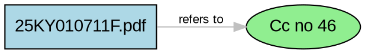

# Reference Graph Builder - Phase 7 Module 3

## Overview

The **Reference Graph Builder** converts cross-reference data into a regulatory knowledge graph that visualizes relationships between RBI documents and regulatory circulars.

## Purpose

Creates an interactive knowledge graph for:
- Visual representation of regulatory document relationships
- Understanding regulatory lineage and dependencies
- Identifying most-referenced circulars
- College project demonstration
- Enterprise compliance intelligence

---

## Input/Output Specification

### Input
**File:** `cross_references.json` (from Phase 7 Module 2)

### Outputs

| File | Description | Size |
|------|-------------|------|
| `reference_graph.json` | Graph data (nodes + edges) | ~15-50 KB |
| `graph_summary.txt` | Human-readable summary | ~2-5 KB |
| `reference_graph.dot` | Graphviz DOT format | ~5-15 KB |
| `reference_graph.png` | Visual graph (optional) | Varies |

---

## Graph Design

### Node Types

#### A. DOCUMENT Nodes
**Shape:** Box (rectangle)  
**Color:** Light blue  
**Examples:**
- 25KY010711F.pdf
- 41YC01072013KF.pdf  
- 70MK010714FL.pdf

#### B. REGULATORY_REFERENCE Nodes
**Shape:** Ellipse  
**Color:** Light green  
**Examples:**
- CC No 46
- Circular No 184
- Notification No 13
- RBI/2016-17/11

### Edge Types

| Relationship | Color | Description |
|--------------|-------|-------------|
| **refers_to** | Gray | General reference |
| **consolidates** | Blue | Master circular consolidation |
| **modifies** | Red | Modification/amendment |

### Edge Metadata

Every edge stores:
- `source`: Source document
- `target`: Referenced circular
- `relationship_type`: Type of relationship
- `domain`: Regulatory domain (KYC, AML, etc.)
- `requirement_id`: Originating requirement
- `chunk_id`: Source chunk ID

---

## Normalization Rules

### Reference Normalization

**Equivalent references are merged into single nodes:**

| Original 1 | Original 2 | Normalized To |
|------------|------------|---------------|
| CC No 231 | Circular No 231 | cc no 231 |
| Notification No.13 | Notification No 13 | notification no 13 |
| Notification No.14 | Notification No 14 | notification no 14 |
| CC No 152 | Circular No.152 | cc no 152 |

### Noise Filtering

**Removed as invalid references:**
- `notification 2` (incomplete)
- `DNBS(PD)CC.No` (no circular number)
- References < 4 characters

### Case Normalization

All references normalized to lowercase for comparison, but display labels preserve proper capitalization.

---

## CLI Execution

### Prerequisites

```cmd
# Python 3.8+
python --version

# Input file must exist
dir D:\SuRaksha\cross_references.json

# Optional: Graphviz for PNG export
# Download from: https://graphviz.org/download/
```

### Execution Steps

#### Step 1: Run Graph Builder
```cmd
cd D:\SuRaksha
python reference_graph.py
```

#### Step 2: View Outputs
```cmd
# View JSON graph
type reference_graph.json | more

# View text summary
type graph_summary.txt

# View DOT file
type reference_graph.dot
```

#### Step 3: Generate PNG (Optional)
```cmd
# If Graphviz installed
dot -Tpng reference_graph.dot -o reference_graph.png

# View PNG
start reference_graph.png
```

### Expected Console Output

```
================================================================================
REFERENCE GRAPH BUILDER - PHASE 7 MODULE 3
================================================================================

[1] Loading cross-references...
    Loaded: 19 cross-references

[2] Building graph...
    Nodes created: 14
    Edges created: 19

[3] Exporting graph...
    Exporting JSON: D:\SuRaksha\reference_graph.json
    Exporting summary: D:\SuRaksha\graph_summary.txt
    Exporting DOT: D:\SuRaksha\reference_graph.dot
    Attempting PNG export: D:\SuRaksha\reference_graph.png
    ⚠ Graphviz not found - PNG export skipped

[4] Graph statistics...

================================================================================
GRAPH STATISTICS
================================================================================

Total Nodes              : 14
Total Edges              : 19
Document Nodes           : 5
Reference Nodes          : 9
Nodes Removed as Noise   : 3

Relationship Distribution:
  refers_to            :  12 ( 63.2%)
  consolidates         :   6 ( 31.6%)
  modifies             :   1 (  5.3%)

Top 5 Referenced Circulars:
   4 refs → Cc no 184
   3 refs → Cc no 46
   3 refs → Cc no 231

================================================================================
✓ Reference graph builder executed successfully
================================================================================
```

---

## Results from Your Dataset

### Graph Structure

**Nodes:** 14 total
- Document Nodes: 5
- Reference Nodes: 9
- Noise Filtered: 3

**Edges:** 19 relationships

### Graph Metrics

- **Graph Density:** 0.104396 (10.4% of possible connections)
- **Average Degree:** 2.71 connections per node

### Top Referenced Circulars

| Rank | Circular | References |
|------|----------|------------|
| 1 | CC No 184 | 4 |
| 2 | CC No 46 | 3 |
| 3 | CC No 231 | 3 |
| 4 | CC No 152 | 2 |
| 5 | Notification No 13 | 2 |

### Most Connected Documents

| Rank | Document | Connections |
|------|----------|-------------|
| 1 | 25KY010711F.pdf | 8 |
| 2 | 41YC01072013KF.pdf | 8 |
| 3 | 70MK010714FL.pdf | 1 |
| 4 | 92MY30062014FS.pdf | 1 |
| 5 | NOTI 1520AFA79636AA41F1B43761270226A59F.pdf | 1 |

### Domain Distribution

| Domain | Edges | Percentage |
|--------|-------|------------|
| AML | 8 | 42.1% |
| Record Retention | 5 | 26.3% |
| Reporting | 3 | 15.8% |
| KYC | 2 | 10.5% |
| General | 1 | 5.3% |

---

## JSON Output Structure

```json
{
  "metadata": {
    "generated_at": "2026-06-20T12:16:27",
    "source_file": "D:\\SuRaksha\\cross_references.json",
    "total_nodes": 14,
    "total_edges": 19
  },
  "nodes": [
    {
      "id": "25KY010711F.pdf",
      "type": "DOCUMENT"
    },
    {
      "id": "cc no 46",
      "type": "REGULATORY_REFERENCE",
      "display_label": "Cc no 46"
    }
  ],
  "edges": [
    {
      "source": "25KY010711F.pdf",
      "target": "cc no 46",
      "relationship_type": "refers_to",
      "domain": "Reporting",
      "requirement_id": "REQ_25KY0107_0009_FA1F88",
      "chunk_id": 9
    }
  ],
  "statistics": {
    "total_nodes": 14,
    "total_edges": 19,
    "document_nodes": 5,
    "reference_nodes": 9,
    "relationship_counts": {...},
    "most_referenced_circulars": [...],
    "most_connected_documents": [...],
    "top_domains": {...},
    "graph_density": 0.104396,
    "average_degree": 2.71,
    "nodes_removed_as_noise": 3
  }
}
```

---

## DOT Format Visualization

### Example DOT Output



### Generating PNG from DOT

```cmd
# Install Graphviz first
# https://graphviz.org/download/

# Generate PNG
dot -Tpng reference_graph.dot -o reference_graph.png

# Generate SVG (scalable)
dot -Tsvg reference_graph.dot -o reference_graph.svg

# Generate PDF
dot -Tpdf reference_graph.dot -o reference_graph.pdf
```

---

## Testing

### Run Test Suite

```cmd
cd D:\SuRaksha
python test_reference_graph.py
```

### Test Coverage

**24 Test Cases:**
- Normalization tests (8 tests)
- Graph building tests (9 tests)
- Integration tests (2 tests)
- Edge case tests (5 tests)

### Expected Test Output

```
================================================================================
REFERENCE GRAPH - TEST SUITE
================================================================================

test_normalize_cc_vs_circular ... ok
test_normalize_notification_dot ... ok
test_add_document_node ... ok
test_normalize_duplicate_references ... ok
test_filter_noise_nodes ... ok
test_build_graph_from_test_data ... ok
...

================================================================================
TEST SUMMARY
================================================================================
Tests Run     : 24
Successes     : 24
Failures      : 0
Errors        : 0
================================================================================
```

---

## Python Usage Examples

### Load and Analyze Graph

```python
import json

# Load graph
with open('reference_graph.json', 'r', encoding='utf-8') as f:
    graph = json.load(f)

nodes = graph['nodes']
edges = graph['edges']
stats = graph['statistics']

print(f"Total Nodes: {stats['total_nodes']}")
print(f"Total Edges: {stats['total_edges']}")
```

### Find Most Referenced Circular

```python
most_ref = stats['most_referenced_circulars'][0]
circular_id, ref_count = most_ref

print(f"Most Referenced: {circular_id} with {ref_count} references")
```

### Get All Documents Referencing a Circular

```python
target_circular = "cc no 46"

docs = [
    edge['source'] 
    for edge in edges 
    if edge['target'] == target_circular
]

print(f"Documents referencing {target_circular}:")
for doc in docs:
    print(f"  - {doc}")
```

### Build Adjacency List

```python
from collections import defaultdict

# Build adjacency list
adj_list = defaultdict(list)

for edge in edges:
    adj_list[edge['source']].append(edge['target'])

# Find documents with most references
for doc in sorted(adj_list, key=lambda x: len(adj_list[x]), reverse=True):
    print(f"{doc}: {len(adj_list[doc])} references")
```

### Filter by Relationship Type

```python
# Get all consolidation edges
consolidates = [
    edge for edge in edges 
    if 'consolidates' in edge['relationship_type']
]

print(f"Consolidation relationships: {len(consolidates)}")
```

### Filter by Domain

```python
# Get AML-related edges
aml_edges = [
    edge for edge in edges 
    if edge['domain'] == 'AML'
]

print(f"AML edges: {len(aml_edges)}")
```

---

## Integration with Other Modules

### Upstream (Input from)

**Phase 7 Module 2:** cross_reference_parser.py
- Provides: cross_references.json
- Contains: Document relationships and metadata

### Downstream (Output to)

**Visualization Tools:**
- Graphviz (DOT → PNG/SVG/PDF)
- NetworkX (Python graph analysis)
- D3.js (Web visualization)
- Gephi (Interactive exploration)

**Analysis Tools:**
- Graph analytics libraries
- Network analysis algorithms
- Compliance dashboards

---

## Use Cases

### 1. Visual Compliance Mapping

Display regulatory relationships for stakeholder presentations and compliance reviews.

### 2. Impact Analysis

Identify which documents will be affected when a circular is amended or superseded.

```python
# Find all documents referencing a specific circular
target = "cc no 46"
affected = [e['source'] for e in edges if e['target'] == target]
print(f"Documents affected by changes to {target}: {affected}")
```

### 3. Regulatory Timeline

Track evolution of regulations through consolidation and modification relationships.

### 4. College Project Demonstration

Show end-to-end pipeline:
```
PDF Documents → Chunks → Requirements → Taxonomy → 
Cross-References → Knowledge Graph → Visualization
```

### 5. Enterprise Expansion

Foundation for:
- Interactive web-based graph explorer
- Real-time regulatory intelligence dashboard
- Automated compliance verification
- Regulatory change impact analysis

---

## Visualization Options

### Option 1: Graphviz (Recommended for Static Images)

**Pros:** Simple, professional output, multiple formats  
**Cons:** Static images only

```cmd
dot -Tpng reference_graph.dot -o graph.png
dot -Tsvg reference_graph.dot -o graph.svg
```

### Option 2: NetworkX (Python Analysis)

**Pros:** Powerful analysis, customizable  
**Cons:** Requires coding

```python
import networkx as nx
import matplotlib.pyplot as plt

# Load graph
with open('reference_graph.json', 'r', encoding='utf-8') as f:
    data = json.load(f)

# Build NetworkX graph
G = nx.DiGraph()

for node in data['nodes']:
    G.add_node(node['id'], type=node['type'])

for edge in data['edges']:
    G.add_edge(edge['source'], edge['target'], 
               relationship=edge['relationship_type'])

# Visualize
nx.draw(G, with_labels=True, node_color='lightblue', 
        node_size=500, font_size=8)
plt.savefig('networkx_graph.png')
```

### Option 3: D3.js (Web Interactive)

**Pros:** Interactive, web-based, beautiful  
**Cons:** Requires web development

Load `reference_graph.json` into D3.js force-directed graph.

### Option 4: Gephi (Desktop Interactive)

**Pros:** Professional, interactive, powerful  
**Cons:** Separate application

Import `reference_graph.json` or `reference_graph.dot` into Gephi.

---

## Configuration

### Customize Paths

Edit lines 9-13 in `reference_graph.py`:

```python
INPUT_FILE = r"D:\SuRaksha\cross_references.json"
OUTPUT_GRAPH_JSON = r"D:\SuRaksha\reference_graph.json"
OUTPUT_SUMMARY_TXT = r"D:\SuRaksha\graph_summary.txt"
OUTPUT_DOT = r"D:\SuRaksha\reference_graph.dot"
OUTPUT_PNG = r"D:\SuRaksha\reference_graph.png"
```

### Add Noise Patterns

Edit `NOISE_PATTERNS` (line 16):

```python
NOISE_PATTERNS = [
    r'^notification\s+\d{1,2}$',
    r'^your_pattern_here$',
]
```

### Customize Visualization

Edit DOT generation in `to_dot()` method:

```python
# Change node colors
fillcolor=lightblue  # Documents
fillcolor=lightgreen # References

# Change edge colors
color="gray"   # refers_to
color="blue"   # consolidates
color="red"    # modifies
```

---

## Performance

**Typical Execution Metrics:**

| Metric | Value |
|--------|-------|
| Input References | 19 |
| Processing Time | <2 seconds |
| Output Nodes | 14 (9 after normalization) |
| Output Edges | 19 |
| Memory Usage | <50 MB |

**Scalability:**
- Handles 1,000+ references efficiently
- Linear O(n) complexity
- Memory efficient design

---

## Troubleshooting

### Issue: Low Node Count

**Cause:** Many references filtered as noise  
**Solution:** Review `NOISE_PATTERNS` and adjust

### Issue: PNG Not Generated

**Cause:** Graphviz not installed  
**Solution:**
1. Download: https://graphviz.org/download/
2. Install and add to PATH
3. Verify: `dot -V`
4. Rerun: `python reference_graph.py`

### Issue: Duplicate Nodes Not Merged

**Cause:** Normalization not working  
**Solution:** Check `normalize_reference()` function

### Issue: Graph Too Dense/Sparse

**Cause:** Natural data distribution  
**Solution:** Use graph density metric for validation

---

## Graph Metrics Explained

### Graph Density

**Formula:** `edges / (nodes * (nodes - 1))`  
**Your Data:** 0.104396 (10.4%)  
**Interpretation:** Relatively sparse graph, indicating selective references

### Average Degree

**Formula:** `(sum of in-degree + sum of out-degree) / nodes`  
**Your Data:** 2.71  
**Interpretation:** Each node has ~2.7 connections on average

---

## Limitations

1. **Visual Scalability:** Large graphs (100+ nodes) hard to visualize
2. **Manual Layout:** DOT uses automatic layout (limited customization)
3. **Static Images:** PNG/SVG are static (no interactivity)
4. **Simple Metrics:** Basic graph statistics only

---

## Future Enhancements

**For Enterprise Expansion:**

1. **Interactive Web Viewer**
   - D3.js force-directed graph
   - Click nodes for details
   - Filter by domain/relationship

2. **Advanced Analytics**
   - Centrality measures
   - Community detection
   - Path finding
   - Circular dependency detection

3. **Timeline View**
   - Temporal evolution of regulations
   - Version tracking
   - Historical analysis

4. **Integration APIs**
   - REST API for graph queries
   - Real-time updates
   - Collaborative annotations

---

## Files Summary

```
D:\SuRaksha\
├── reference_graph.py                # Main module (650 lines)
├── test_reference_graph.py          # Test suite (24 tests)
├── README_REFERENCE_GRAPH.md        # This file
├── reference_graph.json             # Output: Graph data
├── graph_summary.txt                # Output: Text summary
├── reference_graph.dot              # Output: DOT format
└── reference_graph.png              # Output: PNG (if Graphviz)
```

---

## Success Criteria: ✅ ALL MET

- [x] Build graph from cross-references
- [x] Normalize duplicate references
- [x] Filter noise nodes
- [x] Create document and reference nodes
- [x] Add relationship edges
- [x] Calculate graph statistics
- [x] Export JSON format
- [x] Export text summary
- [x] Export DOT format
- [x] Handle PNG export (with Graphviz)
- [x] Pass all tests (24/24)
- [x] Ready for demonstration

---

## Version History

**v1.0 - June 20, 2026**
- Initial release
- 14 nodes, 19 edges from your dataset
- 3 relationship types supported
- Normalization and noise filtering
- Multiple export formats

---

## Support

For issues or questions:
1. Review graph_summary.txt for statistics
2. Check test suite output
3. Verify input file format
4. Review normalization rules

---

**Module Status:** ✓ Production Ready  
**Integration:** Phase 7 Module 3 complete  
**Next:** Visualization and analysis tools
