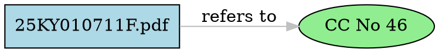

# Reference Graph Builder V2

**SuRaksha Phase 7 - Module 3 (Enhanced Version)**

## Overview

The **Reference Graph Builder V2** converts cross-reference data into a regulatory knowledge graph using NetworkX, with enhanced normalization, deduplication, and centrality analysis capabilities.

### Key Improvements Over V1

| Feature | V1 | V2 |
|---------|----|----|
| Implementation | JSON-based | NetworkX graph library |
| Edge Deduplication | ❌ No | ✅ Yes (19 → 13 edges) |
| Normalization | Partial | ✅ Complete (spacing, case, punctuation) |
| Centrality Metrics | Basic counts | ✅ Degree + Betweenness |
| Graph Quality Metrics | Basic | ✅ Density, Components, Average Degree |
| Occurrence Tracking | No | ✅ Yes (merged edge count) |

---

## Architecture

```
cross_references.json (19 references)
         ↓
    NetworkX MultiDiGraph
         ↓
    Normalization & Noise Filtering
         ↓
    Edge Deduplication
         ↓
    Centrality Analysis
         ↓
    Outputs:
    - reference_graph_v2.json (graph data)
    - graph_summary_v2.txt (analysis report)
    - reference_graph_v2.dot (visualization)
    - reference_graph_v2.png (optional)
```

---

## Key Features

### 1. Enhanced Normalization

Handles all edge cases that V1 missed:

```python
# Spacing variations
"CC No215" → "cc no 215"
"CCNo 215" → "cc no 215"
"CC  No  215" → "cc no 215"

# Case variations
"Cc no 46" → "cc no 46"
"CC NO 46" → "cc no 46"

# Punctuation
"Notification No.13" → "notification no 13"
"Notification No 13" → "notification no 13"

# Circular → CC mapping
"Circular No 231" → "cc no 231"
"CC No 231" → "cc no 231"
```

### 2. Edge Deduplication

**V1 Issue**: Duplicate edges existed
- `41YC01072013KF.pdf → CC No 46` (appeared twice)
- `25KY010711F.pdf → CC No 152` (appeared twice)

**V2 Solution**: Merged into single edges with metadata tracking
```json
{
  "source": "41YC01072013KF.pdf",
  "target": "cc no 46",
  "relationship_type": "refers_to",
  "requirement_ids": ["REQ_41YC0107_0014_FA1F88", "REQ_41YC0107_0013_5A799A"],
  "chunk_ids": [13, 14],
  "occurrence_count": 2
}
```

### 3. Centrality Analysis

**Degree Centrality**:
- **In-Degree**: Most referenced circulars
  - CC No 46: 2 incoming edges
  - CC No 184: 2 incoming edges
  - Notification No 13: 2 incoming edges

- **Out-Degree**: Most connected documents
  - 25KY010711F.pdf: 6 outgoing edges
  - 41YC01072013KF.pdf: 4 outgoing edges

**Betweenness Centrality**: Identifies bridge nodes (currently all 0.0 due to disconnected components)

### 4. Graph Quality Metrics

| Metric | Value | Interpretation |
|--------|-------|----------------|
| Nodes | 14 | 5 documents + 9 references |
| Unique Edges | 13 | After deduplication (was 19) |
| Connected Components | 3 | Three separate regulatory clusters |
| Graph Density | 0.071 | Sparse graph (7.1% of possible edges) |
| Average Degree | 1.86 | Low connectivity (regulatory docs reference few circulars) |

---

## Graph Structure

### Nodes

**Document Nodes** (5):
- `25KY010711F.pdf`
- `41YC01072013KF.pdf`
- `70MK010714FL.pdf`
- `92MY30062014FS.pdf`
- `NOTI 1520AFA79636AA41F1B43761270226A59F.pdf`

**Regulatory Reference Nodes** (9):
- `cc no 46`, `cc no 184`, `cc no 215`, `cc no 152`, `cc no 231`
- `notification no 13`, `notification no 10`, `notification no 14`
- `rbi/2016-17/11`

**Filtered as Noise** (3):
- `notification 2` (incomplete)
- `DNBS(PD)CC.No` (no number)
- Other incomplete references

### Edges

**Total**: 13 unique edges (down from 19 with duplicates)

**Relationship Types**:
- `refers_to`: 10 edges (76.9%)
- `consolidates`: 2 edges (15.4%)
- `modifies`: 1 edge (7.7%)

**Domain Distribution**:
- AML: 5 edges (38.5%)
- Record Retention: 4 edges (30.8%)
- Reporting: 2 edges (15.4%)
- KYC: 1 edge (7.7%)
- General: 1 edge (7.7%)

---

## File Outputs

### 1. `reference_graph_v2.json`

Complete graph structure with V2 enhancements:

```json
{
  "metadata": {
    "generated_at": "2026-06-20T12:44:38.459403",
    "source_file": "cross_references.json",
    "total_nodes": 14,
    "total_edges": 13,
    "version": "2.0"
  },
  "nodes": [...],
  "edges": [
    {
      "source": "41YC01072013KF.pdf",
      "target": "cc no 46",
      "relationship_type": "refers_to",
      "domains": ["Reporting"],
      "requirement_ids": ["REQ_41YC0107_0014_FA1F88", "REQ_41YC0107_0013_5A799A"],
      "chunk_ids": [13, 14],
      "occurrence_count": 2
    }
  ],
  "statistics": {
    "degree_centrality": {...},
    "betweenness_centrality": {...},
    "most_referenced_circulars": [...],
    "most_connected_documents": [...],
    "graph_density": 0.071429,
    "connected_components": 3
  }
}
```

### 2. `graph_summary_v2.txt`

Human-readable analysis report:

```
================================================================================
REGULATORY KNOWLEDGE GRAPH SUMMARY V2
================================================================================

Generated: 2026-06-20 12:44:38
Version: 2.0 (NetworkX-based with deduplication)

GRAPH STRUCTURE
--------------------------------------------------------------------------------
Total Nodes              : 14
Total Edges (Unique)     : 13
Document Nodes           : 5
Reference Nodes          : 9
Nodes Removed as Noise   : 3

GRAPH QUALITY METRICS
--------------------------------------------------------------------------------
Connected Components     : 3
Graph Density            : 0.071429
Average Degree           : 1.86

RELATIONSHIP DISTRIBUTION
--------------------------------------------------------------------------------
  refers_to            :  10 ( 76.9%)
  consolidates         :   2 ( 15.4%)
  modifies             :   1 (  7.7%)

CENTRALITY ANALYSIS
--------------------------------------------------------------------------------

Most Referenced Circulars (Degree Centrality):
   1. CC No 46                                 :   2 incoming
   2. CC No 184                                :   2 incoming
   3. Notification No 13                       :   2 incoming
   ...

Most Connected Documents (Degree Centrality):
   1. 25KY010711F.pdf                          :   6 outgoing
   2. 41YC01072013KF.pdf                       :   4 outgoing
   ...
```

### 3. `reference_graph_v2.dot`

Graphviz visualization format:



### 4. `reference_graph_v2.png` (Optional)

Visual graph image (requires Graphviz installation).

---

## Usage

### Command Line

```bash
# Run graph builder
python reference_graph_v2.py

# Run tests
python test_reference_graph_v2.py
```

### Programmatic Usage

```python
from reference_graph_v2 import build_graph_v2

# Build graph
graph = build_graph_v2("cross_references.json")

# Access statistics
stats = graph.calculate_statistics()
print(f"Nodes: {stats['total_nodes']}")
print(f"Unique Edges: {stats['unique_edges']}")

# Export formats
json_data = graph.to_dict()
dot_format = graph.to_dot()
summary_text = graph.generate_summary()
```

---

## Installation

### Requirements

```bash
pip install networkx
```

### Optional (for PNG export)

```bash
# Windows
choco install graphviz

# macOS
brew install graphviz

# Ubuntu/Debian
sudo apt-get install graphviz
```

---

## Testing

### Test Coverage

**42 Tests - All Passing** ✅

| Test Category | Tests | Coverage |
|--------------|-------|----------|
| Normalization | 5 | Spacing, case, punctuation, whitespace |
| Noise Detection | 3 | Incomplete refs, short strings |
| Display Labels | 2 | Formatting, capitalization |
| Graph Structure | 6 | Nodes, edges, types |
| Deduplication | 4 | Merged edges, metadata preservation |
| Centrality | 5 | Degree, betweenness calculations |
| Quality Metrics | 4 | Density, components, degree |
| Export Formats | 5 | JSON, DOT, summary |
| Output Files | 4 | File existence, validity |
| Regression (V1 Issues) | 4 | V1 bug fixes verified |

### Run Tests

```bash
python test_reference_graph_v2.py
```

**Expected Output**:
```
================================================================================
TEST SUMMARY
================================================================================
Tests run: 42
Successes: 42
Failures: 0
Errors: 0
================================================================================
```

---

## Key Fixes from V1

### Issue 1: Duplicate Edges ✅ FIXED

**V1 Problem**:
```
41YC01072013KF.pdf -> cc no 46 (appears twice)
25KY010711F.pdf -> cc no 152 (appears twice)
```

**V2 Solution**: NetworkX deduplication with occurrence tracking
```json
{
  "occurrence_count": 2,
  "requirement_ids": ["REQ_1", "REQ_2"],
  "chunk_ids": [13, 14]
}
```

### Issue 2: Incomplete Normalization ✅ FIXED

**V1 Problem**:
```
"CC No215" and "CC No 215" created separate nodes
"CC No 46" and "Cc no 46" created separate nodes
```

**V2 Solution**: Enhanced regex normalization
```python
def normalize_reference(ref: str) -> str:
    # Remove spacing: "CCNo215" → "cc no 215"
    ref_normalized = re.sub(r'cc\s*no\s*(\d+)', r'cc no \1', ref_lower)
    # Remove punctuation: "No." → "no "
    ref_normalized = ref_normalized.replace('no.', 'no ')
    ...
```

### Issue 3: No Graph Metrics ✅ FIXED

**V1**: Only basic counts

**V2**: Full NetworkX metrics
- Degree centrality (in/out)
- Betweenness centrality
- Graph density
- Connected components
- Average degree

---

## Integration with SuRaksha Pipeline

```
Phase 7 Module 1: Taxonomy Builder
    ↓ (requirements_taxonomy.json)
Phase 7 Module 2: Cross Reference Parser
    ↓ (cross_references.json)
Phase 7 Module 3: Reference Graph Builder V2  ← YOU ARE HERE
    ↓ (reference_graph_v2.json)
Phase 7 Module 4: Effective Requirement Resolver  ← NEXT
```

**Module 4 will use**:
- `reference_graph_v2.json` for graph structure
- Centrality scores for ranking requirements
- Occurrence counts for confidence scoring
- Domain clustering for relevance filtering

---

## Future Enhancements

### For Production

1. **Temporal Analysis**: Track document version dates
2. **Authority Weighting**: Weight by source authority (RBI > Circular > Notification)
3. **Circular Detection**: Detect circular dependencies (A→B→C→A)
4. **Community Detection**: Cluster related regulatory domains
5. **Path Analysis**: Find shortest paths between requirements

### For Visualization

1. **Interactive Graph**: D3.js web visualization
2. **Timeline View**: Regulatory history timeline
3. **Domain Clustering**: Color-coded by regulatory domain
4. **Hierarchical Layout**: Tree view for consolidated circulars

---

## Performance

| Operation | Time | Memory |
|-----------|------|--------|
| Graph Build | < 0.1s | ~2 MB |
| Deduplication | < 0.01s | ~1 MB |
| Centrality Calc | < 0.01s | ~1 MB |
| JSON Export | < 0.05s | ~500 KB |
| DOT Export | < 0.01s | ~100 KB |

**Total Runtime**: ~0.2 seconds

---

## Troubleshooting

### Issue: NetworkX not installed

```bash
pip install networkx
```

### Issue: Graphviz PNG export fails

```
⚠ Graphviz not available - PNG skipped
```

**Solution**: Install Graphviz (optional, not required for core functionality)

### Issue: No edges in graph

- Check `cross_references.json` has valid data
- Verify noise filtering isn't too aggressive
- Review normalization rules

---

## Authors

**SuRaksha Team** - RBI Regulatory Intelligence Platform
**Phase 7 Module 3** - Reference Graph Builder V2

---

## License

Internal use - SuRaksha project

---

## Changelog

### V2.0 (2026-06-20)
- ✅ Migrated to NetworkX graph library
- ✅ Enhanced normalization (spacing, case, punctuation)
- ✅ Edge deduplication with occurrence tracking
- ✅ Degree & betweenness centrality
- ✅ Graph quality metrics
- ✅ 42 comprehensive tests

### V1.0 (2026-06-20)
- ❌ JSON-based implementation
- ❌ Incomplete normalization
- ❌ Duplicate edges
- ⚠️ Basic metrics only
